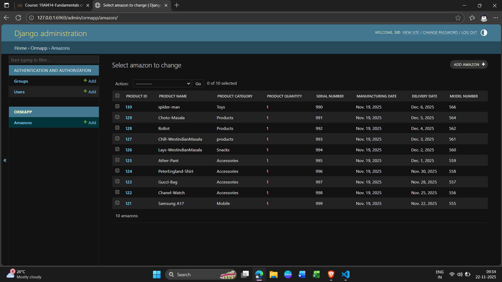

# Ex01 Django ORM Web Application

## Date: 22.11.2025

## AIM
To develop a Django Application to store and retrieve data from a E-Commerce Website Database for Amazon or Flipkart using Object Relational Mapping(ORM).

## DESIGN STEPS

### STEP 1:
Clone the problem from GitHub

### STEP 2:
Create a new app in Django project

### STEP 3:
Enter the code for admin.py and models.py

### STEP 4:
Detect changes and create migration files that describe how to modify the database schema

### STEP 5:
Execute the migration files and update the database schema to match your Django models

### STEP 6:
Create a superuser with full access rights to all models and data through the admin interface.

### STEP 7:
Apply the migration files of the created app to the database

### STEP 8:
Execute Django admin using localhost and create details for 10 entries

## PROGRAM
"""
models.py

class Amazon(models.Model):
    Product_id=models.IntegerField(primary_key=True)
    Product_name=models.CharField(max_length=100)
    Product_category=models.CharField(max_length=100)
    Product_quantity=models.IntegerField()
    Serial_number=models.IntegerField()
    Manufacturing_Date=models.DateField()
    Delivery_date=models.DateField()
    model_number=models.IntegerField()
    

class AmazonAdmin(admin.ModelAdmin):
    list_display=["Product_id","Product_name", "Product_category", "Product_quantity","Serial_number","Manufacturing_Date","Delivery_date","model_number"]

admin.py

from django.contrib import admin 
from .models import (Amazon,AmazonAdmin)
admin.site.register(Amazon,AmazonAdmin)

"""

## OUTPUT

## RESULT
Thus the program for creating E-commerce website database using ORM hass been executed successfully
